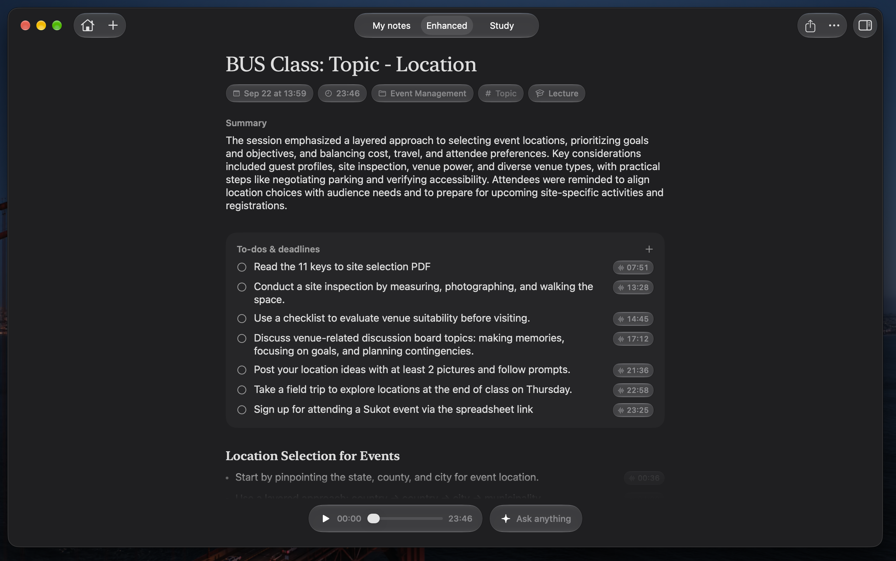
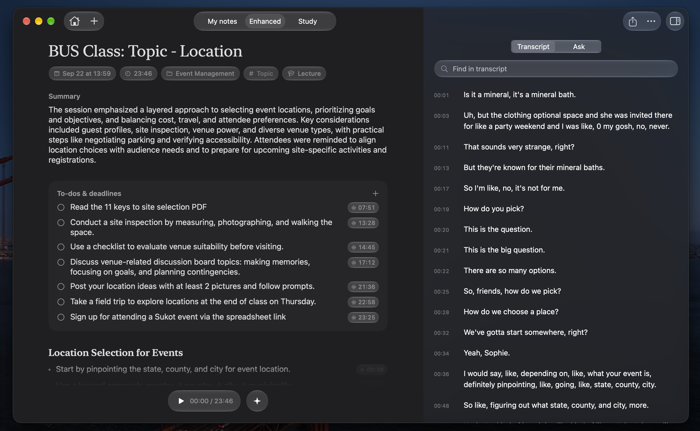
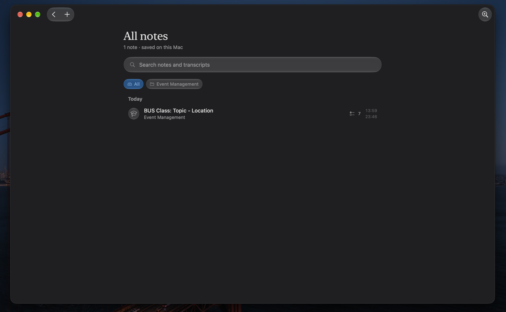

# Cereal

  <strong>Turn lectures and meetings into notes you can actually use.</strong> 
  A local-first recording and study notebook for macOS.

  

  <a href="#download">Download</a> ·
  <a href="#get-started">Get started</a> ·
  <a href="#what-cereal-does">Features</a> ·
  <a href="#screenshots">Screenshots</a> ·
  <a href="#privacy-and-storage">Privacy</a> ·
  <a href="CONTRIBUTING.md">Contributing</a>

  
  
  

  

<em>One recording becomes a summary, organized notes, actionable to-dos, and study material.</em>

Cereal records a lecture, class, interview, or meeting while you write your own notes. It transcribes the audio on your Mac, keeps the recording and transcript together, and can use Apple Intelligence to turn them into structured notes you can trace back to the source. There is no account or cloud backend in this project.

> [!NOTE]
> Cereal targets **macOS 27**. Apple Intelligence is needed for enhanced notes and Ask; recording, transcription, playback, search, and export have their own availability requirements described below.

## Download

Use the **Download Cereal** button above to get the latest DMG directly. Open it, drag **Cereal** into **Applications** as shown in the installer window, then launch it from Applications. You can also browse [all releases](https://github.com/Neel-Sh/Cereal/releases).

Cereal checks for updates automatically and shows a glass banner when a new version is available. You can also choose **Check for Updates…** from the Cereal menu or Settings. Update downloads are verified with Sparkle's signature key.

## What Cereal does

| Feature | What it gives you |
| --- | --- |
| **Record your way** | Capture a microphone alone, or record computer audio and your microphone as separate tracks for online classes and calls. Pause, resume, and watch a live waveform. |
| **Follow along** | Open the **Live** panel for on-device transcription while recording. After saving, Cereal creates a timestamped transcript from the saved audio. |
| **Keep your own notes** | Write and edit notes before, during, and after a recording. Add a course, topic, and template: Lecture, Seminar, Lab, Study group, Office hours, Meeting, or Interview. |
| **Make the material useful** | **Enhance** can create a summary, organized notes, source-linked to-dos, flashcards, and practice questions. The selected template guides the output. |
| **Ask your notes** | Ask questions about one note, a course, or the whole library. Answers link to transcript passages you can play. |
| **Find and share** | Search titles, notes, and transcripts; filter by course; pin important notes; copy or share notes; export Markdown or PDF with the transcript. |

If Cereal is useful to you, a [star](https://github.com/Neel-Sh/Cereal/stargazers) helps other students find it.

## Screenshots

### Read the transcript beside your notes

The transcript inspector stays next to your notes. Search within it, select a passage to jump in the recording, or use the source timestamps on enhanced notes and to-dos.

  

### Find everything again

The library groups notes by date, keeps pinned notes at the top, and lets you search across notes and transcripts or filter by course.

  

## Get started

1. Clone this repository and open <code>Cereal.xcodeproj</code> in Xcode 27, then run the **Cereal** scheme on a Mac running macOS 27. You can also build and launch it from Terminal:

       git clone https://github.com/Neel-Sh/Cereal.git
       cd Cereal
       ./script/build_and_run.sh

2. Create a note with **⌘N**. Give it a title, course, and topic if you like; choose a template and an audio source.
3. Choose **Microphone** for an in-person session or **Computer audio** for an online class or call. Grant the requested macOS permissions.
4. Select **Start Recording**. Write in **My notes** as you listen, and open **Live** to follow the live transcript.
5. Select **Stop & Save**. Cereal saves the audio and notes, then transcribes the recording. Open the note to play it, inspect the transcript, and select **Enhance** when Apple Intelligence is available.

The first transcription may need to download Apple's on-device speech assets. Transcription also requires a language supported by the Mac's speech model. If transcription is unavailable, the recording remains saved.

### Permissions and requirements

| Capability | What Cereal needs |
| --- | --- |
| Microphone recording | Access under **System Settings → Privacy & Security → Microphone**. |
| Computer audio | **System Audio Recording Only** under **System Settings → Privacy & Security → Screen & System Audio Recording**. This audio-only capture does not record video. |
| Calendar-based names | Optional calendar access. Connect your calendar from a new note to offer the current event title. |
| Enhanced notes and Ask | Apple Intelligence enabled and available on the Mac, plus a completed timestamped transcript. |
| Open at login | Optional setting; macOS may also require approval in **System Settings → General → Login Items**. |

## Calls and the menu bar

Cereal stays in the menu bar after its window closes. You can start a microphone or computer-audio recording there, pause or save an active recording, reopen the window, and open Settings.

With **Offer to record when a call starts** enabled, Cereal watches for another app using the microphone and offers to record. This can include Zoom, FaceTime, Teams, Slack, or a call in a browser. A call recording uses the **Meeting** template and, when calendar access is available, can use the current event's title. Choose **Record** to start; Cereal does not start recording a detected call without that choice. When the call ends, it offers to stop and save. You can opt into automatic stop in Settings, and exclude apps from future prompts with **Don't ask for…**.

Computer-audio recordings retain a mixed file for playback and separate microphone and system-audio tracks. Cereal transcribes those tracks as **Me** and **Them**; speaker labeling depends on the quality of each source. Headphones can help keep the other side of a call out of your microphone track.

## From recording to study material

1. **Capture:** Cereal saves the recording and your draft notes in its sandboxed Application Support folder. If an interruption leaves a recoverable recording, Cereal attempts to restore it on the next launch.
2. **Transcribe:** Apple's on-device speech tools produce timed passages after saving. Use **Retranscribe** from a note's **•••** menu to try again or add timestamps to an older note.
3. **Enhance:** Apple Intelligence uses the transcript and your notes to make a summary, organized points, to-dos, and study cards and questions. A generated title can replace a default title. Edit the result and use its timestamps to inspect the original passage.
4. **Review:** Play or seek the audio, mark to-dos complete, search the transcript, ask follow-up questions, and export the note as Markdown or PDF.

Generated summaries and answers can be imperfect. The recording and source links are there so you can check what was actually said.

## Keyboard shortcuts

| Shortcut | Action |
| --- | --- |
| **⌘N** | New note |
| **⌘Space** | Start recording, or stop and save |
| **⌘⇧P** | Pause or resume a recording; play or pause a saved recording |
| **⌘⇧T** | Show or hide the live transcript while recording |
| **⌘1 / ⌘2 / ⌘3** | My notes / Enhanced / Study |
| **⌘E** | Enhance the current note |
| **⌘J** | Ask about the current note |
| **⌘⇧C** | Copy notes |
| **⌘,** | Settings |

## Privacy and storage

- Audio, notes, transcripts, and the lecture index live under <code>Cereal/</code> in the app's sandboxed **Application Support** directory. Call recordings retain the separate audio tracks alongside the mixed recording.
- Speech transcription and Apple Intelligence generation run on device. The app has no sign-in, sync service, or API key. Apple's speech assets may download the first time they are needed.
- Calendar access is optional. Cereal uses it to find an event happening now for a suggested note title.
- Ask conversations are kept in memory for the current app session; saved notes and recordings remain in the local library.
- Deleting a note from the library removes its indexed note and associated recording files. Export anything you want to keep first.

## Project layout

| Path | Purpose |
| --- | --- |
| <code>Cereal/App</code> and <code>Cereal/Views</code> | App scenes, recorder, library, note detail, transcript, Ask, menu bar, and settings UI |
| <code>Cereal/Services</code> | Audio capture, playback, speech transcription, Apple Intelligence, calendar, and exports |
| <code>Cereal/Stores</code> | Local note library and call preferences/coordinator |
| <code>Cereal/Models</code> | Notes, transcript passages, templates, study items, and action items |
| <code>script/build_and_run.sh</code> | Build and launch the macOS app |
| <code>script/make_release.sh</code> and <code>RELEASES.md</code> | Create a notarized app, signed DMG, and Sparkle feed |
| <code>docs/social-preview.png</code> | 1280×640 social preview composed from the screenshots above. GitHub does not set this from the repo. Upload it under Settings → General → Social preview. |

The build script stops a running Cereal process, builds the Debug app with <code>xcodebuild</code>, and opens the new build. It also accepts <code>--verify</code>, <code>--debug</code>, <code>--logs</code>, and <code>--telemetry</code> for local development.
